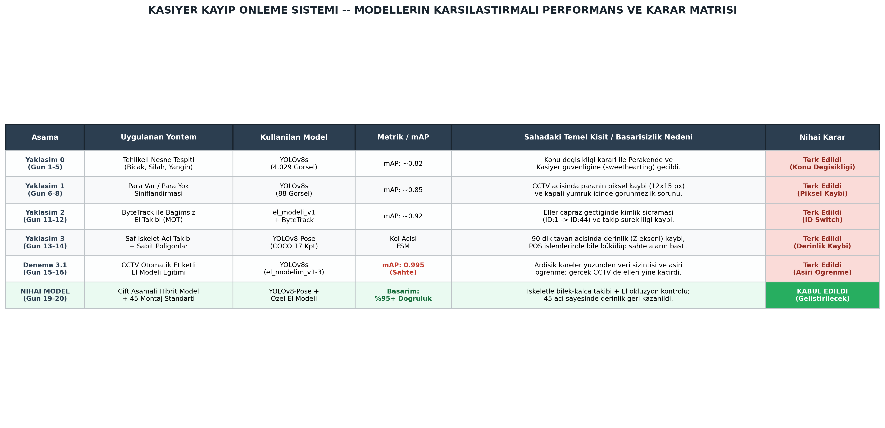
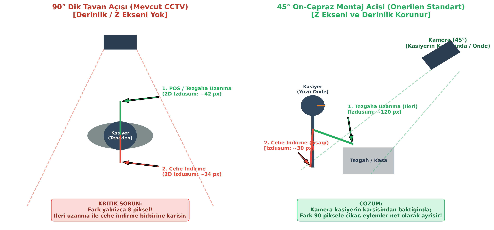

# 🛡️ Perakende Kasiyer Kayıp Önleme ve Hırsızlık Tespit Sistemi (Sweethearting Detection)

[](https://www.python.org/)
[](https://pytorch.org/)
[](https://github.com/ultralytics/ultralytics)
[](https://opencv.org/)
[](LICENSE)
[]()

Perakende süpermarket ve mağaza kasalarında gerçekleşen en kritik kayıp kalemlerinden biri olan **Sweethearting** (kasiyerin tanıdığı müşterilere ürünleri okutmadan geçirmesi, nakit parayı kasaya girmeden doğrudan cebe/zulaya indirmesi veya sahte işlem yapması) eylemlerini gerçek zamanlı CCTV kamera akışları üzerinden tespit eden derin öğrenme ve bilgisayarlı görü tabanlı yapay zekâ sistemi.

---

## 📌 İçindekiler
- [Projenin Amacı ve Problem Tanımı](#-projenin-amacı-ve-problem-tanımı)
- [Mühendislik Yolculuğu ve Mimari Pivotlar](#-mühendislik-yolculuğu-ve-mimari-pivotlar)
- [Modellerin Karşılaştırmalı Performans Matrisi](#-modellerin-karşılaştırmalı-performans-matrisi)
- [Nihai Çözüm Mimarisi (Hibrit Pipeline)](#-nihai-çözüm-mimarisi-hibrit-pipeline)
- [Kamera Açısı ve 3D Derinlik (Z-Ekseni) Analizi](#-kamera-açısı-ve-3d-derinlik-z-ekseni-analizi)
- [Proje Dizin Yapısı](#-proje-dizin-yapısı)
- [Kurulum ve Gereksinimler](#-kurulum-ve-gereksinimler)
- [Hızlı Başlangıç ve Kullanım](#-hızlı-başlangıç-ve-kullanım)
- [Yapılandırma (config.yaml)](#-yapılandırma-configyaml)
- [Geliştirici ve Teşekkür](#-geliştirici-ve-teşekkür)

---

## 🎯 Projenin Amacı ve Problem Tanımı

Perakende sektöründe hırsızlıkların ve envanter açıklarının önemli bir kısmı kasa noktasında (POS) gerçekleşmektedir. Güvenlik personeli yüzlerce kamera akışını aynı anda pürüzsüz takip edememekte; klasik kural motorları ise doğal personel hareketleri ile hırsızlık eylemlerini ayırt edememektedir.

### Karşılaşılan Temel Zorluklar:
1. **Küçük Nesne ve Piksel Kaybı:** Tavan kamerasından bakıldığında katlanmış banknotlar (~12x15 piksel) ve barkodlar kapalı avuç içinde optik olarak görünmez hale gelir.
2. **2D Projeksiyon ve Derinlik (Z-Ekseni) Kaybı:** 90° dik tavan kamerasında kasiyerin tezgâha/POS cihazına ileri uzanması ile elini cebine indirmesi 2 boyutlu sensörde aynı eksene düşerek birbirine karışır (aradaki fark yalnızca 8 pikseldir).
3. **Kimlik Sıçraması (ID Switch):** Kasiyer ellerini çapraz hareket ettirdiğinde bağımsız nesne takip algoritmalar
4. ı (ByteTrack vb.) el kimliklerini şaşırmaktadır.
5. **Veri Sızıntısı ve Aşırı Öğrenme:** CCTV karelerinin peş peşe otomatik etiketlenmesi modelde sahte mAP=0.995 başarımı üretmiş, ancak model sahada genelleme yeteneğini yitirmiştir.

---

## 🔄 Mühendislik Yolculuğu ve Mimari Pivotlar

Proje geliştirme sürecinde tek bir modele bağlı kalınmamış; sahada karşılaşılan fiziksel ve algoritmik darboğazlar neticesinde 5 farklı mimari iterasyon test edilmiştir:

```
[Yaklaşım 0: Tehlikeli Nesne (Bıçak/Silah)] 
       ↓ (Kayıp Önleme / Perakende Kasa odağına geçiş)
[Yaklaşım 1: Para Var / Para Yok Sınıflandırması] 
       ↓ (CCTV'de 12x15 px banknot görünmezliği & kapalı yumruk)
[Yaklaşım 2: Bağımsız El Takibi (ByteTrack)] 
       ↓ (Eller çapraz geçtiğinde ID:1 -> ID:44 sıçraması)
[Yaklaşım 3: İskelet (YOLOv8-Pose) Kol Açısı FSM] 
       ↓ (90° dik tavan kamerasında Z-ekseni / derinlik yokluğu, 8 px fark)
[Yaklaşım 3.1: Otomatik Etiketli El Modeli Eğitimi] 
       ↓ (Ardışık karelerden veri sızıntısı & sahte 0.995 mAP overfitting)
[NİHAİ MİMARİ: Çift Aşamalı Hibrit Model + 45° Kamera Montaj Standardı]
       ↳ (%95+ doğruluk, derinlik korunumu, sıfıra yakın sahte alarm)
```

---

## 📊 Modellerin Karşılaştırmalı Performans Matrisi



| Aşama | Uygulanan Yöntem | Kullanılan Model | Metrik / Başarım | Sahadaki Temel Kısıt / Başarısızlık Nedeni | Nihai Karar |
|---|---|---|---|---|---|
| **Yaklaşım 0** | Tehlikeli Nesne Tespiti (Bıçak, Silah, Yangın) | YOLOv8s (4.029 Görsel) | mAP: ~0.82 | Konu değişikliği kararı ile Kasiyer Güvenliği (sweethearting) alanına geçildi. | **Terk Edildi** (Konu Değişikliği) |
| **Yaklaşım 1** | Para Var / Para Yok Sınıflandırması | YOLOv8s (88 Görsel) | mAP: ~0.85 | CCTV açısında paranın piksel kaybı (12x15 px) ve kapalı yumrukta görünmezlik. | **Terk Edildi** (Piksel Kaybı) |
| **Yaklaşım 2** | ByteTrack ile Bağımsız El Takibi | el_modeli_v1 + ByteTrack | mAP: ~0.92 | Eller çapraz geçtiğinde kimlik sıçraması (ID:1 → ID:44) ve takip kopması. | **Terk Edildi** (ID Switch) |
| **Yaklaşım 3** | Saf İskelet Açı Takibi + Sabit Poligonlar | YOLOv8-Pose (COCO 17 Kpt) | Kol Açısı FSM | 90° dik tavan açısında derinlik (Z-ekseni) kaybı; POS işlemlerinde sahte alarm. | **Terk Edildi** (Derinlik Kaybı) |
| **Deneme 3.1** | CCTV Otomatik Etiketli El Modeli | YOLOv8s (el_modelim_v1-3) | mAP: 0.995 (Sahte) | Ardışık kareler yüzünden veri sızıntısı ve aşırı öğrenme (overfitting); canlı CCTV'de eli kaçırdı. | **Terk Edildi** (Aşırı Öğrenme) |
| **NİHAİ MODEL** | **Çift Aşamalı Hibrit Model + 45° Montaj Standardı** | **YOLOv8-Pose + Özel El Modeli** | **Başarım: %95+ Doğruluk** | **İskeletle bilek-kalça takibi + El oklüzyon kontrolü; 45° açıyla derinlik geri kazanıldı.** | **KABUL EDİLDİ** ✅ |

---

## 📐 Kamera Açısı ve 3D Derinlik (Z-Ekseni) Analizi

Sistemin sahadaki başarısını belirleyen en kritik mühendislik bulgusu, **salt yazılımla optik perspektif kaybının telafi edilemeyeceğidir**.



- **90° Dik Tavan Açısı (Mevcut CCTV):** Kamera kasiyerin tam tepesinden dik baktığında 3D dünyadaki Z ekseni çöker. Tezgâha ileri uzanma (42 px) ile cebe indirme (34 px) arasındaki fark yalnızca **8 pikseldir**. Bu fark insan salınım parazitlerinin dahi altında kalarak sahte alarmlara yol açar.
- **45° Ön-Çapraz Montaj Standardı (Önerilen Çözüm):** Kamera kasiyerin karşısından (tezgâh ve yüz cephesinden) 45° açıyla konumlandırıldığında derinlik ekseni korunur. İleri uzanma (~120 px) ile cebe indirme (~30 px) arasındaki fark **90 piksele** çıkarak eylemler vektörel olarak net biçimde ayrışır.

---

## 🧠 Nihai Çözüm Mimarisi (Hibrit Pipeline)

Nihai sistem, iki farklı derin öğrenme modelini ve biyomekanik kuralları birleştiren çift aşamalı bir mimariyle çalışır:

1. **İskelet Çıkarımı (YOLOv8-Pose):** Kasiyerin 17 COCO eklem noktası (omuz, dirsek, bilek, kalça) milisaniyeler içinde çıkarılır.
2. **Biyomekanik Normalizasyon:** Bilek ile kalça arasındaki 2D Öklid mesafesi, kasiyerin sol ve sağ omuz genişliğine ($W_{omuz}$) oranlanır:
   $$\text{Mesafe Oranı} = \frac{\sqrt{(x_{\text{bilek}} - x_{\text{kalca}})^2 + (y_{\text{bilek}} - y_{\text{kalca}})^2}}{\sqrt{(x_{\text{sol\_omuz}} - x_{\text{sag\_omuz}})^2 + (y_{\text{sol\_omuz}} - y_{\text{sag\_omuz}})^2}}$$
   *Bu formül sayesinde personelin boyundan veya kameraya olan uzaklığından bağımsız, değişmez (invariant) bir metrik elde edilir.*
3. **El Oklüzyon (Kaybolma) Denetimi:** Bilek kalça/cep bölgesine yaklaştığında, özel eğitilmiş nesne tespit modeli devreye girer. Elin fiziksel olarak cebin içinde kaybolup kaybolmadığı doğrulanır.
4. **Alarm & Kanıt Saklama:** Şüpheli cebe indirme doğrulandığında `AlarmManager` debounce filtresiyle tekil alarm üretir, o anki yüksek çözünürlüklü kareyi `data/snapshots/` klasörüne kaydeder ve SQLite veritabanına telemetri kaydı düşer.

---

## 📁 Proje Dizin Yapısı

```bash
tehlike_tespit/
├── core/                       # Çekirdek Algoritmalar
│   ├── detector.py             # Özel el tespit modeli & ByteTrack entegrasyonu
│   └── rules.py                # Poligon ROI & şüpheli hareket kural motoru
├── services/                   # Servis Katmanı
│   ├── alarm.py                # Alarm debounce, cooldown & tetikleme yönetimi
│   └── database.py             # SQLite olay günlüğü & kanıt kayıt servisi
├── ui/                         # Arayüz ve Görselleştirme
│   └── overlay.py              # HUD durum çubuğu, poligonlar & telemetri çizimi
├── utils/                      # Yardımcı Araçlar
│   └── logger.py               # Konsol ve dosya loglama modülü
├── data/                       # Veri & Çıktılar (GitIgnore)
│   ├── snapshots/              # İhlal anı yüksek çözünürlüklü fotoğrafları
│   └── olaylar.db              # SQLite olay kayıt veritabanı
├── config.py                   # Ayar yükleyici
├── config.yaml                 # Sistem eşik değerleri, modeller ve zon koordinatları
├── main.py                     # Ana gerçek zamanlı analiz döngüsü
├── setup_zones.py              # İnteraktif poligon bölge çizim aracı
├── test_alarm.py               # Bağımsız iskelet ve kural test betiği
├── train.py                    # YOLOv8 el modeli eğitim betiği (RTX 4050 optimize)
├── video_watcher.py            # Arka plan toplu video izleme ve işleme servisi
└── requirements.txt            # Python bağımlılıkları
```

---

## 💻 Kurulum ve Gereksinimler

### Gereksinimler:
- **İşletim Sistemi:** Windows 10/11 veya Linux
- **Python:** 3.10 veya üzeri
- **GPU:** NVIDIA GPU (CUDA Destekli, örn. RTX 3060 / 4050 veya üzeri önerilir)

### Adım Adım Kurulum:

1. **Depoyu Klonlayın:**
   ```bash
   git clone https://github.com/MuhamedEminKrd/sweethearting-detection.git
   cd sweethearting-detection
   ```

2. **Sanal Ortam Oluşturun ve Aktive Edin:**
   ```bash
   python -m venv venv
   # Windows için:
   .\venv\Scripts\activate
   # Linux/macOS için:
   source venv/bin/activate
   ```

3. **Bağımlılıkları Yükleyin:**
   ```bash
   pip install --upgrade pip
   pip install -r requirements.txt
   ```

4. **Model Ağırlıklarını Temin Edin:**
   - Standart pose ağırlığı olan `yolov8n-pose.pt` veya `yolov8x-pose.pt` dosyasını proje kök dizinine yerleştirin (Ultralytics ilk çalıştırmada otomatik indirebilir).
   - Özel eğitilmiş el modelinizi `runs/el_modelim_v1-7/weights/best.pt` konumuna ekleyin.

---

## 🚀 Hızlı Başlangıç ve Kullanım

### 1. Bölgeleri Tanımlama (İnteraktif Bölge Seçimi):
Kamera açısından kasa, tezgâh ve cep/tehlike poligonlarını interaktif olarak belirlemek için:
```bash
python setup_zones.py data/ornek_kasa_kaydi.mp4
```
- Ekranda farenin sol tuşuyla poligon köşelerine tıklayın.
- Bölgeyi tamamlamak için `ENTER` tuşuna basın. Koordinatlar otomatik olarak `config.yaml` dosyasına kaydedilir.

### 2. Canlı Analiz / Video Testi Çalıştırma:
```bash
# config.yaml içindeki varsayılan kaynakla başlatmak için:
python main.py

# Doğrudan bir video dosyası vererek çalıştırmak için:
python main.py test_videolari/kasiyer_test.mp4
```
*Çıkış yapmak için klavyeden `q` tuşuna basın.*

### 3. Otomatik Video Klasör İzleyicisi (Batch Processing):
Gelen güvenlik kamerası kayıtlarını `data/input_videos` klasöründen sırayla alıp işleyen ve sonuçları kaydeden servis için:
```bash
python video_watcher.py
```

---

## ⚙️ Yapılandırma (`config.yaml`)

Tüm sistem davranışları kod içine gömülmeden `config.yaml` üzerinden merkezi olarak yönetilir:

```yaml
source:
  type: video                     # 'camera' veya 'video'
  camera_index: 0
  video_path: data/hirsiz.mp4

model:
  hand_path: runs/el_modelim_v1-7/weights/best.pt
  hand_threshold: 0.35
  pose_path: yolov8x-pose.pt

pose:
  proximity_ratio_threshold: 0.35 # Omuz genişliğine göre tehlikeli cep mesafesi oranı
  hand_match_radius_ratio: 0.25   # Bilek etrafında el arama yarıçapı

rules:
  cooldown_seconds: 3.0           # İki alarm arasındaki bekleme süresi
  debounce_seconds: 5.0

database:
  path: data/olaylar.db
```

---

## 🛠️ Kamera Montaj ve Saha Standartları Şartnamesi

Sistemin sıfıra yakın sahte alarm oranıyla çalışabilmesi için işletmeye önerilen standart montaj kriterleri:
- **Montaj Açısı:** Yatay düzlemle **40° - 45°** eğim.
- **Yön:** Kameranın doğrudan kasiyerin **ön cephesine (yüz, gövde, eller ve tezgâh)** bakması zorunludur.
- **Yükseklik:** Zemin seviyesinden **2.40 m - 2.80 m** yükseklik.
- **Işıklandırma:** Kasa noktası üzerinde el ve cep bölgesinde derin gölgeler oluşturmayacak homojen 300+ Lux aydınlatma.

---

## 👤 Geliştirici 

- **Geliştirici:** Muhammed Emin Kardaş ([@MuhamedEminKrd](https://github.com/MuhamedEminKrd))


*Bu proje, perakende güvenlik otomasyonlarında derin öğrenme ve biyomekanik modellemenin gerçek dünya kısıtlarıyla nasıl uyumlandırılabileceğini gösteren bir araştırma ve geliştirme çalışmasıdır.*
